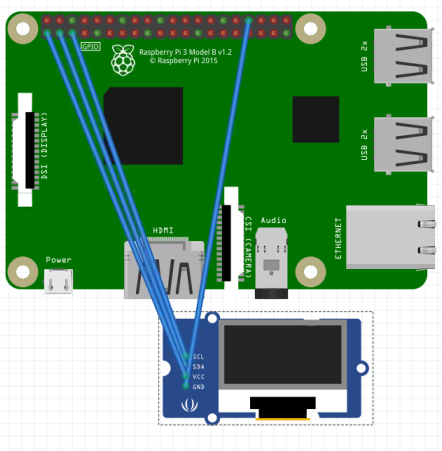

# NewYorkCoin-raspberry
0.96 I2C Display On Raspberry


First of all you have to install these packages with these commands:
```
sudo apt-get update
sudo apt-get install pip3
sudo apt-get install python3.7 
sudo apt-get install git
sudo pip3 install time
sudo pip3 install sys
sudo pip3 install json
sudo pip3 install urllib.request
sudo pip3 install Adafruit_SSD1306
```

Now do:
```
sudo raspi-config
Interfacecing Options > I2C > yes > exit
```
Now do connect the display




```
GND>GND

VNC>3.3V

SLC>GPIO.3

SDA>GPIO.2
```


Now do:
```
git clone https://github.com/NewYorkCoinNYC/NewYorkCoin-raspberry

cd NewYorkCoin-raspberry

nano nycscreen.py

go: url = "https://nycapiserver.newyorkcoin.xyz/balance/RWDyZSjfZMtJG4c6r3xDuUzA2tKrz7MGQB" and edit this url with our wallet example:

"https://nycapiserver.newyorkcoin.xyz/balance/your-address"

ctrl + x, press s, enter
```
now do:
```
watch -n 30 python3.7 nycscreen.py
```
If it doesn't work check if you have enetered the right url and check the ""

or

make sure the pin is not badly connected and make sure the display is not a 128x64 Pixel I2C

